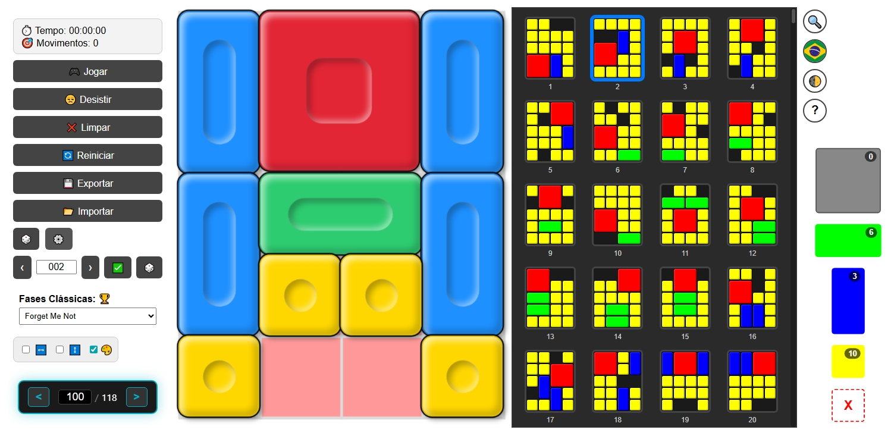

# 🧩 Giiker Super Slide - Klotski Solver & Game
Eglish and Spanish translation of this Readme file is available below.

Este projeto é uma implementação web completa do quebra-cabeça Giiker Super Slide (Klotski), permitindo jogar fases oficiais, criar desafios personalizados e utilizar um resolvedor automático.

teste agora / test now: https://klotski-web.onrender.com
---

  

## 🚀 Guia de Instalação e Execução

### 1. Instalação do Node.js
Para rodar o servidor local, você precisa do Node.js instalado:
1. Acesse o site oficial: [nodejs.org](https://nodejs.org/).
2. Baixe a versão **LTS** (mais estável).
3. Execute o instalador e siga os passos padrão ("Next" até o fim).

### 2. Como Rodar o Site
Existem duas formas de iniciar o projeto:

**Pelo Terminal:**
* Abra o prompt de comando (CMD) ou terminal na pasta do projeto.
* Digite o comando: `node server.js`

**Ou use o run.bat.**

Após iniciar, abra o seu navegador e acesse: `http://localhost:3000` (ou a porta exibida no terminal).

---

## ✨ Funcionalidades (Features)

* **Seletor de 511 Fases:** Biblioteca completa de níveis oficiais com progressão de dificuldade balanceada.
* **Modo Customizado:** Liberdade total para **criar, jogar ou resolver** qualquer configuração de puzzle Klotski manualmente.
* **Resolvedor Automático (Solver):** Algoritmo inteligente que calcula e mostra o passo a passo para vencer qualquer fase.
* **Modo Fullscreen:** Expanda o jogo para preencher a tela inteira para uma experiência mais imersiva.
* **Modo Claro/Escuro:** Troca dinâmica de temas para melhor conforto visual.
* **Tradução Multi-idioma:** Interface disponível em **Português, Inglês e Espanhol**.

---

## 🌍 Languages / Idiomas

### 🇺🇸 English
A complete web implementation of the Giiker Super Slide. Includes 511 levels, custom puzzle builder, automatic solver, light/dark modes, and fullscreen support. 
**To run:** Use `node server.js` or using run.bat

### 🚀 Installation and Execution Guide

#### 1. Installing Node.js
To run the local server, you need Node.js installed:
1. Go to the official website: [nodejs.org](https://nodejs.org/).
2. Download the **LTS** version.
3. Run the installer and follow the standard steps.

#### 2. How to Run the Site
* **Via Terminal:** Open the command prompt in the project folder and type: `node server.js`
* **Using run.bat:** Simply double-click the `run.bat` file provided in the root folder.

After starting, open your browser and go to: `http://localhost:3000`

### ✨ Features
* **511-Level Selector:** Full library with balanced difficulty progression.
* **Custom Mode:** Create, play, or solve any Klotski puzzle configuration.
* **Automatic Solver:** Intelligent algorithm that shows step-by-step solutions.
* **Fullscreen Mode:** Expand the game for a more immersive experience.
* **Light/Dark Mode:** Dynamic theme switching.
* **Multi-language Translation:** Available in English, Portuguese, and Spanish.

---

### 🇪🇸 Español
Una implementación web completa de Giiker Super Slide. Incluye 511 niveles, creación de puzzles personalizados, solucionador automático, modo claro/oscuro y pantalla completa.
**Para ejecutar:** Use `node server.js` o usando run.bat 

---

## 🛠️ Tecnologias / Technologies
* HTML5 / CSS3 / JavaScript (Vanilla)
* Node.js (Servidor Backend)
